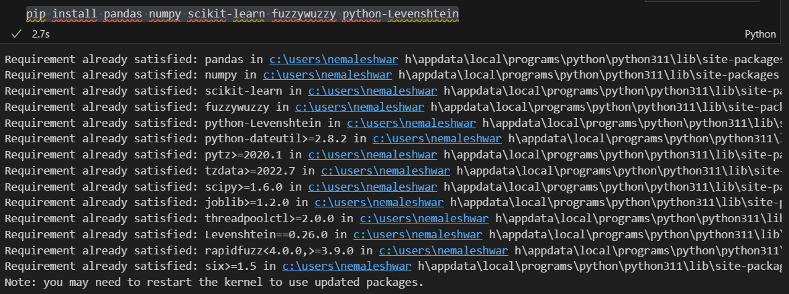
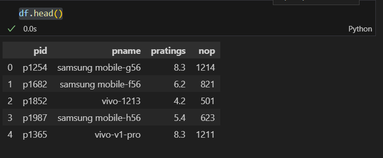
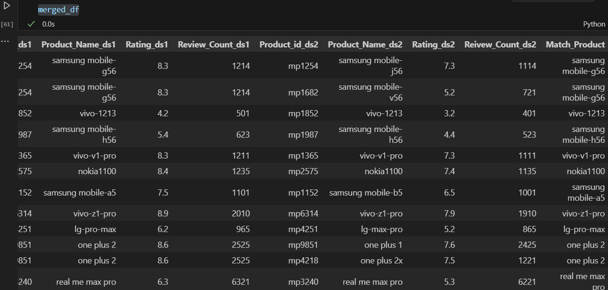
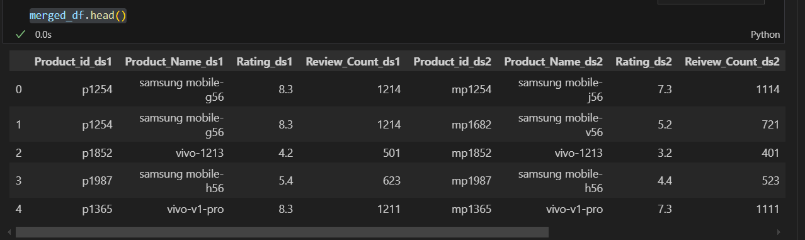
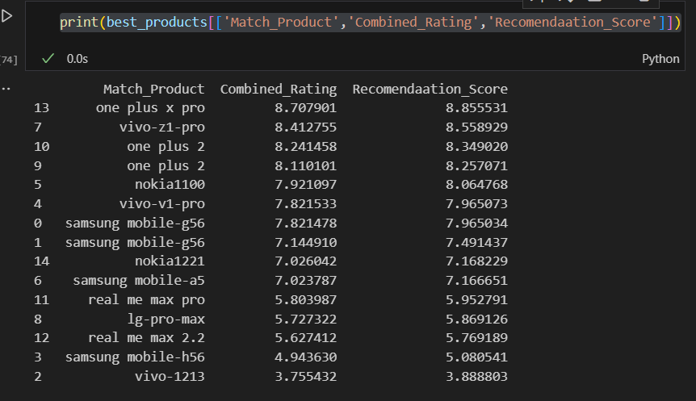
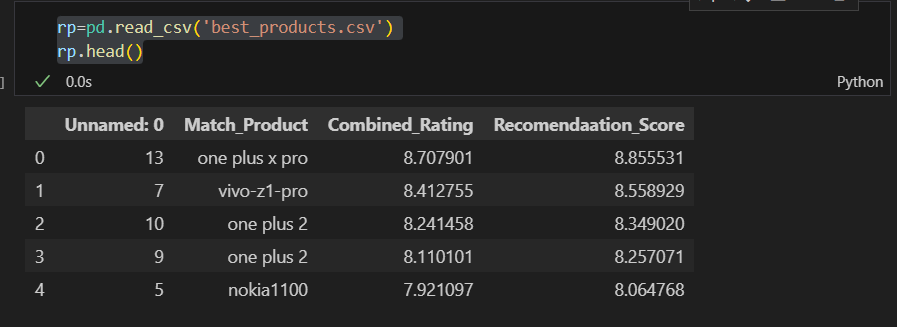

# AppDSExno-03

**AIM:**

To Implement Recommendation Systems using the suitable data sets.

**ALGORITHM:**

STEP 1: Load the necessary Datasets.

STEP 2: Include the necessary python library.

STEP 3: Use Fuzzy library for handling text data.

STEP 4: Perform Data Preprocessing Steps.

STEP 5: Standardize column names for merging.

STEP 6: Apply fuzzy matching to find similar text data between datasets.

STEP 7: Perform Data transformation between datasets.

STEP 8: Define a recommendation score using the features of the datasets.

STEP 9: Sort the data by recommendation score.

STEP 10: Export the results to a CSV file.


**CODING & OUTPUT**

```py
import pandas as pd
import numpy as np
pip install pandas numpy scikit-learn fuzzywuzzy python-Levenshtein
```

```py
from fuzzywuzzy import process
from sklearn.preprocessing import MinMaxScaler
df = pd.read_csv('emobile.csv')
df.head()
```

```py
dx = pd.read_csv('maxmobile.csv')
dx.drop_duplicates(inplace=True)
df.drop_duplicates(inplace=True)
df.columns =['Product_id','Product_Name','Rating','Review_Count_ds1']
dx.columns=['Product_id','Product_Name','Rating','Reivew_Count_ds2']
```

```py
def match_products(name,choices,limit=1):
    results = process.extract(name,choices,limit=limit)
    return results[0][0] if results else None
dx['Match_Product']= dx['Product_Name'].apply(lambda x:match_products(x,df['Product_Name'].tolist()))
merged_df = pd.merge(df,dx,left_on='Product_Name',right_on='Match_Product',how='inner',suffixes=('_ds1','_ds2'))
merged_df
```

```py
x=merged_df['Review_Count_ds1']+merged_df['Reivew_Count_ds2']
merged_df['Combined_Rating']= (merged_df['Rating_ds1']*merged_df['Review_Count_ds1']+merged_df['Rating_ds2']*merged_df['Reivew_Count_ds2'])/x
merged_df['Recomendaation_Score']=0.7*merged_df['Combined_Rating']+0.3*merged_df['Rating_ds1']
merged_df.head()
```

```py
best_products = merged_df.sort_values(by='Recomendaation_Score',ascending=False)
best_products.columns
print(best_products[['Match_Product','Combined_Rating','Recomendaation_Score']])
```

```py
best_products[['Match_Product','Combined_Rating','Recomendaation_Score']].to_csv('best_products.csv')
rp=pd.read_csv('best_products.csv')
rp.head()
```



**RESULT**

Thus we have sucessfully completed Recomendation Systems